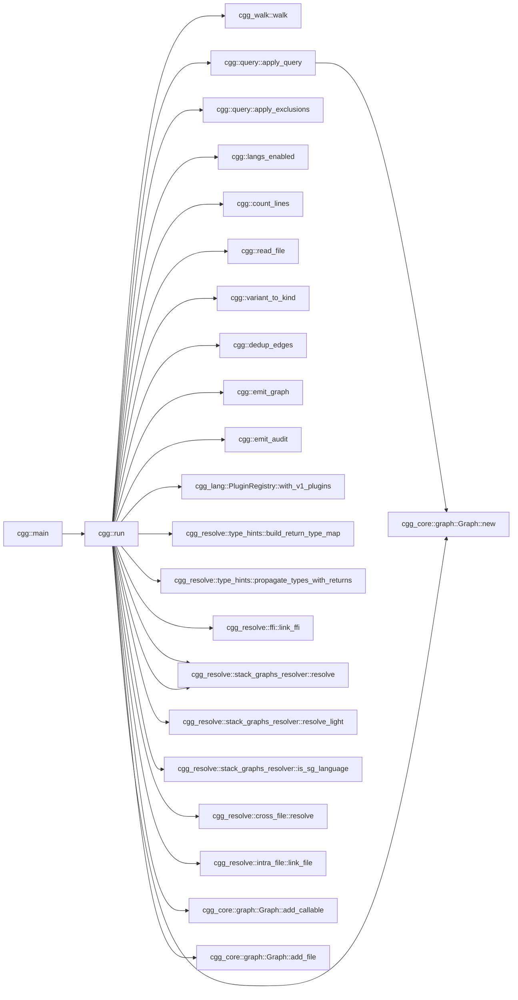
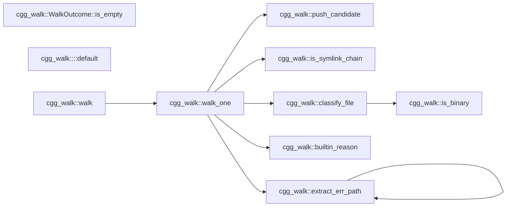
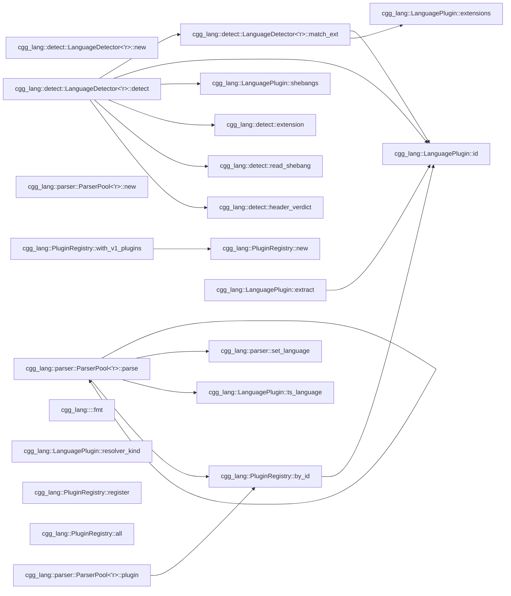

# cgg — Call Graph Generator

`cgg` generates call graphs from source code. Point it at a directory,
get a mermaid diagram. No language server, no build step, no
configuration — one binary, instant results.

The primary output is **mermaid flowcharts** — a format that coding
agents (Copilot, Claude, Cursor, Aider, etc.) can read directly in
context to understand how functions call each other across a codebase.
When an agent needs to know "what calls this function?" or "what does
this function depend on?", `cgg` answers in a format the agent already
understands.

## Why mermaid?

Mermaid diagrams are:
- **Readable by agents** — plain text, no binary formats, fits in a prompt
- **Renderable by humans** — GitHub, GitLab, VS Code, and every major
  markdown viewer renders them inline
- **Filterable** — `--filter` + `-n` lets you extract exactly the
  subgraph an agent needs for a specific task
- **Diffable** — text output means call graph changes show up in PRs

Other formats (JSON, DOT, GraphML) are available for toolchain
integration, but mermaid is the default because it works everywhere
with zero setup.

## Quick start

```bash
cargo install --path crates/cgg
cgg ./src -o graph.mmd
```

That's it. `graph.mmd` is a mermaid flowchart you can paste into any
markdown file, feed to an agent, or render in a viewer.

### Give an agent context about a module

```bash
# "Here's how the auth module works"
cgg ./src --filter 'auth::' -n 1 -o auth-graph.mmd
```

### Trace all paths through a function

```bash
# "Show me every call chain that passes through process_order"
cgg ./src --filter 'process_order' -n 0 -o paths.mmd
```

### Full project graph as structured JSON

```bash
cgg ./src -t json -o graph.json
```

## CLI

```
cgg <paths>... [-o FILE] [-t mermaid|json|dot|graphml]
              [--filter PATTERN]... [-n N] [--max-paths N]
              [--exclude-partial SUBSTRING]...
              [--exclude-glob PATTERN]...
              [--exclude-regex PATTERN]...
              [--stack-graphs auto|on|off]
              [--jobs N] [--lang rust,python,...]
              [--audit-format json|jsonl] [--metrics FILE]
              [-v|-vv|-q]
```

| Flag | Default | Description |
|------|---------|-------------|
| `-t` | mermaid | Output format: `mermaid`, `json`, `dot`, `graphml` |
| `-o` | stdout | Output file (use `-` for stdout) |
| `--filter` | (none) | Regex on qualified names; prefix `glob:` for glob |
| `-n` | -1 (full) | Hop depth around filter matches; `0` = full paths |
| `--exclude-partial` | (none) | Exclude nodes containing substring |
| `--exclude-glob` | (none) | Exclude nodes matching glob |
| `--exclude-regex` | (none) | Exclude nodes matching regex |
| `--stack-graphs` | auto | `auto`: 60s timeout + light fallback; `on`/`off` |
| `--jobs` | 0 (auto) | Rayon thread count for parallel extraction |
| `--lang` | (all) | Comma-separated language filter |
| `--metrics` | sidecar | Force audit output to a specific file |
| `--audit-format` | json | `json` (batched) or `jsonl` (streaming) |

## How it works

```
source files
    │
    ▼
┌─────────────────────────────────────────────────────────┐
│  cgg-walk      file discovery (.gitignore, deny-list)   │
├─────────────────────────────────────────────────────────┤
│  cgg-lang      tree-sitter parse → extract callables    │
│                21 language plugins                       │
├─────────────────────────────────────────────────────────┤
│  cgg-resolve   link calls to definitions                │
│                ├── type propagation (params, locals,     │
│                │   constructors, return types)           │
│                ├── intra-file (scope + containment)      │
│                ├── cross-file (imports, pub-use, #include)│
│                └── FFI (PyO3, wasm-bindgen, napi, JNI,  │
│                    P/Invoke, C ABI)                      │
├─────────────────────────────────────────────────────────┤
│  query engine  --filter + -n (BFS neighborhood / paths) │
├─────────────────────────────────────────────────────────┤
│  cgg-format    mermaid │ json │ dot │ graphml           │
└─────────────────────────────────────────────────────────┘
    │
    ▼
mermaid flowchart (or json/dot/graphml)
```

Every phase is offline and deterministic. No network calls, no
language servers, no build artifacts required.

## Agent integration patterns

### Inject call context into a prompt

```bash
# Generate the subgraph around the function the agent is about to modify
cgg ./src --filter 'OrderService::submit' -n 2 -o /tmp/context.mmd
# Then include /tmp/context.mmd in the agent's context window
```

### Pre-commit: detect unintended coupling

```bash
# In CI or a git hook — fail if a module gains unexpected cross-boundary calls
cgg ./src --filter 'internal::' -n 1 -t json | jq '.edges | length'
```

### Continuous documentation

```bash
# Regenerate architecture diagrams on every push
cgg ./src --filter 'main$|run$|handle' -n 1 -o docs/entry-points.mmd
```

### Scope a refactoring

```bash
# "What would break if I change this function's signature?"
cgg ./src --filter 'parse_config' -n 0 -t mermaid
# Shows every entry-to-exit path through parse_config
```

## Supported languages (21)

| Language | Cross-file resolution | Type inference | Notes |
|----------|----------------------|----------------|-------|
| Rust | pub-use chains, Cargo.toml crate names | params, `Foo::new()` | Module paths from src/ |
| Python | from-import, import-as | params, `Foo()` | `__init__.py` package walk |
| JavaScript | ESM import, CJS require() | params | exports.fn, defineGetter |
| TypeScript | ESM import | params | Delegates to JS walker |
| Go | package imports | params, `var T`, `New*()` | Interface methods, func literals |
| Java | import, import static | params, `Type var`, `new Foo()` | Local variable types |
| Kotlin | import, as alias | params, `val x: T`, `Foo()` | Class-as-constructor |
| C | `#include` transitive (depth 8) | — | Macros as callables |
| C++ | `#include` transitive | — | Templates, operators |
| C# | using, using static, alias | params, `Type var`, `new Foo()` | Accessors |
| Bash | `source ./file.sh` | — | Builtin filter |
| Ruby | require/require_relative | — | initialize → Constructor |
| PHP | require_once/include | — | — |
| Objective-C | #import | — | Message expressions |
| R | library(), source() | — | `<-` and `=` assignment |
| Swift | import Module | — | init → Constructor |
| Lua | require('mod') | — | Colon method syntax |
| Dart | import 'file.dart' | — | — |
| Scala | import pkg.Class | — | Object declarations |
| HCL | — | — | Block labels as definitions |
| Zig | @import("std") | — | — |

## Self-analysis

`cgg` run on its own source (685 callables, 978 edges, 165 cross-file, 100ms). This is the 1-hop neighborhood of `cgg::run` — every edge is a
real cross-crate function call:

```bash
cgg ./crates -t mermaid --filter 'cgg::run$' -n 1
```



Focus on subsystems with `--filter`:

```bash
cgg ./crates/cgg-walk -t mermaid          # walker internals
cgg ./crates --filter 'cgg_resolve::' -n 1 -t mermaid  # resolution pipeline
```

<!-- cgg:begin:walk -->

<!-- cgg:end:walk -->

<!-- cgg:begin:lang -->

<!-- cgg:end:lang -->

## Output formats

| Format | Use case |
|--------|----------|
| **mermaid** (default) | Agent context, markdown docs, PR descriptions |
| **json** | Programmatic consumption, custom tooling, CI checks |
| **dot** | Graphviz rendering for large graphs |
| **graphml** | Import into yEd, Gephi, or other graph analysis tools |

## Resolution pipeline

`cgg` doesn't just find function definitions — it resolves which
function each call site actually targets:

1. **Type propagation** — infer variable types from parameters, local
   declarations, constructors (`Foo::new()`, `new Foo()`), and return
   types
2. **Intra-file linking** — scope-based, smallest-enclosing-range
   containment with receiver-hint narrowing
3. **Cross-file resolution** — walk import chains, `#include`
   transitive closure (depth 8), pub-use re-export chains
4. **FFI linking** — detect `#[pyfunction]`, `#[wasm_bindgen]`,
   `#[napi]`, `@JNI`, `[DllImport]`, `extern "C"` and link across
   language boundaries

Edges carry confidence levels and resolver provenance so downstream
tools can filter by quality.

## Audit / metrics

Every run produces a structured audit trail:
- Files discovered, analyzed, and skipped (with reasons)
- Every callable extracted
- Every unresolved call site (with failure reason)
- Timing per phase

Written as a sidecar (`<output>.audit.json`) or forced to a path with
`--metrics FILE`. Use `--audit-format jsonl` for streaming/SIEM
integration.

## Benchmark

Run `./scripts/benchmark.sh` to reproduce on real-world projects:

| Project | Language | Callables | Edges | Cross-file | Time |
|---------|----------|-----------|-------|------------|------|
| ripgrep | rust | 2,766 | 4,041 | 54% | 469ms |
| flask | python | 388 | 234 | 30% | 52ms |
| express | javascript | 92 | 59 | 20% | 21ms |
| zod | typescript | 1,675 | 2,410 | 65% | 225ms |
| fzf | go | 1,048 | 4,785 | 47% | 154ms |
| gson | java | 943 | 1,354 | 54% | 61ms |
| okio | kotlin | 3,673 | 5,484 | 72% | 345ms |
| jq | c | 1,073 | 20,819 | 93% | 112ms |
| nlohmann/json | cpp | 1,122 | 2,244 | 58% | 111ms |
| serilog | csharp | 828 | 432 | 68% | 70ms |
| acme.sh | bash | 1,433 | 3,904 | 0% | 156ms |
| jekyll | ruby | 902 | 1,237 | 63% | 72ms |
| laravel | php | 13,464 | 253 | 0% | 1585ms |
| AFNetworking | objc | 299 | 113 | 7% | 53ms |
| ggplot2 | r | 946 | 419 | 3% | 104ms |
| Alamofire | swift | 829 | 998 | 63% | 82ms |
| kong | lua | 2,782 | 0 | — | 203ms |
| flame | dart | 1,647 | 0 | — | 88ms |
| play | scala | 1,989 | 487 | 0% | 217ms |
| terraform-vpc | hcl | 1,779 | 0 | — | 81ms |
| http.zig | zig | 451 | 832 | 52% | 87ms |

## Limitations

- No macro expansion for C/C++ (preprocessor defines are not followed)
- No full type inference (trait dispatch, generics, dynamic typing)
- No daemon / watch mode
- Additional languages not yet supported: Elixir, Haskell, OCaml, Perl, Groovy

## License

Apache-2.0 OR MIT (dual). All transitive dependencies use MIT,
Apache-2.0, BSD, ISC, Unlicense, CC0, or BlueOak — enforced by
`cargo-deny`.
