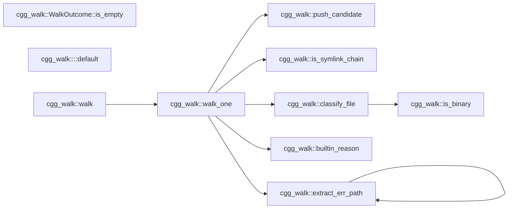
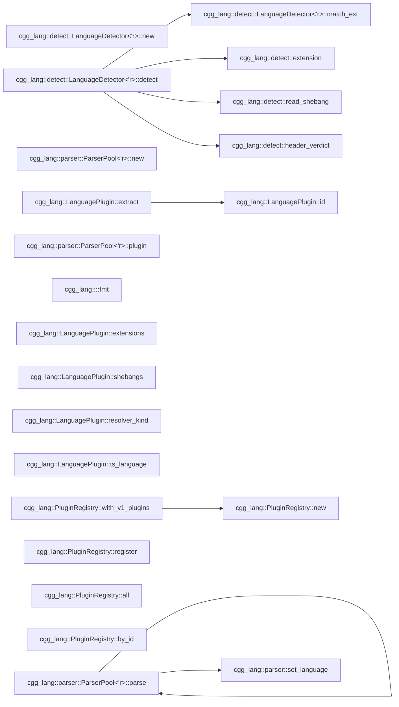

# cgg — Call Graph Generator

`cgg` is a single-binary, offline, multi-language call graph generator
written in Rust. It parses source code with tree-sitter and resolves
callable-to-callable edges to near-LSP quality without running any
language server.

Supported v1 languages: **Rust, Python, JavaScript, TypeScript, Go,
Java, Kotlin, C, C++, C#, Shell/Bash, Ruby, Swift**.

## Quick start

```
cargo install --path crates/cgg
cgg ./some/folder ./other/folder -o my-app.mmd -t mermaid
```

Optional filtering to N-hop neighborhoods or full entry-to-exit call
paths:

```
cgg ./src --filter 'process_order' -n 2
cgg ./src --filter 'glob:handle_*' -n 0 -t json -o paths.json
```

## CLI options

```
cgg <paths>... [-o FILE] [-t mermaid|json|dot|graphml]
              [--filter PATTERN]... [-n N] [--max-paths N]
              [--stack-graphs auto|on|off]
              [--jobs N] [--lang rust,python,...]
              [--audit-format json|jsonl] [--metrics FILE]
              [-v|-vv|-q]
```

| Flag | Default | Description |
|------|---------|-------------|
| `-t` | mermaid | Output format: `mermaid`, `json`, `dot`, `graphml` |
| `-o` | stdout | Output file (use `-` for stdout) |
| `--filter` | (none) | Regex pattern on qualified names; prefix `glob:` for glob |
| `-n` | -1 (full) | Hop depth around filter matches; `0` = full paths |
| `--stack-graphs` | auto | `auto`: 60s timeout + light fallback; `on`: no timeout; `off`: skip |
| `--jobs` | 0 (auto) | Rayon thread count for parallel extraction |
| `--lang` | (all) | Comma-separated language filter |
| `--metrics` | sidecar | Force audit output to a specific file |
| `--audit-format` | json | `json` (batched) or `jsonl` (streaming) |

## Performance

Benchmarked on real-world projects (default `--stack-graphs=auto`):

| Project | Language | Files | Callables | Edges | Time |
|---------|----------|-------|-----------|-------|------|
| ripgrep | Rust | 102 | 2,851 | 1,625 | 1.4s |
| flask | Python | 83 | 1,460 | 955 | 2.8s |
| express | JS | 141 | 127 | 199 | 10.4s |
| zod | TS | 409 | 1,462 | 1,857 | 32.6s |
| fzf | Go | 80 | 893 | 760 | **0.38s** |
| caddy | Go | 310 | 2,506 | 1,725 | **0.73s** |
| jq | C | 55 | 1,111 | 21,030 | 1.4s |
| redis | C | 802 | 14,594 | 500,681 | 29.6s |
| nlohmann/json | C++ | 489 | 4,941 | 3,896 | 2.7s |
| spdlog | C++ | 148 | 1,400 | 9,708 | 1.5s |
| Newtonsoft.Json | C# | 945 | 11,688 | 2,661 | **2.1s** |
| serilog | C# | 214 | 1,705 | 916 | **0.34s** |

With `--stack-graphs=off` (fastest, cross-file resolver only):

| Project | Time | Notes |
|---------|------|-------|
| lodash (JS) | 0.3s | vs 60s with auto timeout |
| bat (Rust) | 0.5s | vs 68s with auto timeout |
| typeorm (TS, 3545 files) | 15s | vs 60s with auto timeout |

The 60-second timeout fires automatically for pathological codebases
that trigger exponential path stitching in the stack-graphs library.
A lightweight BFS fallback recovers ~20-25% of the edges that full
resolution would find.

## Self-analysis

`cgg` is dogfooded on its own code. Both diagrams below were produced
by running `cgg` against this repository; neither is hand-drawn. Test
modules are filtered out and duplicate intra-file edges are deduped
for readability.

**`cgg-walk` — directory walker with built-in deny list and
gitignore/cggignore support:**

Generated with:
```
cgg ./crates/cgg-walk -t mermaid -o walk.mmd
```

<!-- cgg:begin:walk -->

<!-- cgg:end:walk -->

Reading it: `walk` fans out to `walk_one`, which in turn consults the
built-in deny-list (`builtin_reason`), walks error paths
(`extract_err_path`, recursively), checks symlink targets
(`is_symlink_chain`), and classifies each surviving file
(`classify_file` → `is_binary`) before producing a `FileCandidate`
(`push_candidate`).

**`cgg-lang` — language detector and plugin registry:**

Generated with:
```
cgg ./crates/cgg-lang/src/detect.rs ./crates/cgg-lang/src/parser.rs \
    ./crates/cgg-lang/src/lib.rs -t mermaid
```

<!-- cgg:begin:lang -->

<!-- cgg:end:lang -->

Reading it: `LanguageDetector::detect` consults `extension`,
`read_shebang`, and `header_verdict` (the `.h` disambiguator) before
delegating to `match_ext`. `ParserPool::parse` calls the private
`set_language` helper. `PluginRegistry::with_v1_plugins` wires every
plugin in via `register`.

Both graphs are reproducible on any checkout and will grow as the
codebase grows. They're kept in sync by a pre-commit hook (see
`.githooks/pre-commit`); run `scripts/install-hooks.sh` once to
activate it locally.

## Architecture

```
cgg (binary)
├── Phase 1: cgg-walk        — file discovery (.gitignore, deny-list, binary sniff)
├── Phase 2: cgg-lang        — detect language, parse (tree-sitter), extract callables
│   └── 13 plugins           — rust, python, javascript, typescript, go, java, kotlin, c, cpp, csharp, bash, ruby, swift
├── Phase 3: cgg-resolve     — resolution pipeline
│   ├── intra-file linker    — scope-based, smallest-enclosing-range
│   ├── stack-graphs         — tree-sitter-stack-graphs (with timeout + light fallback)
│   ├── cross-file resolver  — import-chain walking, #include transitive, pub-use chains
│   └── FFI linker           — PyO3, wasm-bindgen, napi, JNI, P/Invoke, C ABI
├── Phase 4: query engine    — --filter + -n (BFS neighborhood / full paths)
└── Phase 5: cgg-format      — mermaid, json, dot, graphml
```

## Output formats

`-t mermaid | json | dot | graphml`. The internal graph is shared; each
formatter is a thin transform over the same IR.

- **mermaid**: `flowchart LR` with `C<n>` node IDs and qualified-name labels.
- **json**: Full graph serialized via serde (callables, edges, files, metrics).
- **dot**: Graphviz `digraph` with `rankdir=LR` and box nodes.
- **graphml**: XML with node label and language data keys.

## Audit / metrics

Every file considered, every file skipped, every callable extracted,
and every unresolved call is tracked in a structured audit log. An
audit sidecar (`<output>.audit.json`) is written alongside the graph.
Use `--metrics FILE` to force a specific path, or `--audit-format
jsonl` for streaming per-file events (SIEM-friendly).

## Scope

- Nodes: callables only (functions, methods, named lambdas, callable
  properties, default methods on objects).
- Edges: "A calls B" within a language or across a declared FFI boundary
  (both sides must be inside the scanned roots).
- Entry / exit detection: pure topology (in-degree 0 / out-degree 0).
  Emergent HTTP handlers and registered callbacks surface naturally.
- Cycles (recursion, mutual recursion) are preserved — never silently
  removed.
- Edge deduplication: same (src, dst, site_byte) keeps highest confidence.

## Out of scope (v1)

- Additional languages (PHP, Scala, Dart, Lua, HCL). These require
  tree-sitter 0.25+ (ABI 15) which is incompatible with our current
  stack-graphs dependency. Plugin trait makes them straightforward to
  add once the tree-sitter ecosystem upgrades.
- Real-LSP implementation behind the `ResolverService` trait — seam
  exists; implementation deferred.
- Daemon / watch mode.
- Macro expansion for C / C++ (macro call sites are emitted as
  unresolved with an audit note).

## License

Apache-2.0 OR MIT (dual). All transitive dependencies use MIT,
Apache-2.0, BSD, ISC, Unlicense, CC0, or BlueOak — enforced by
`cargo-deny`.
