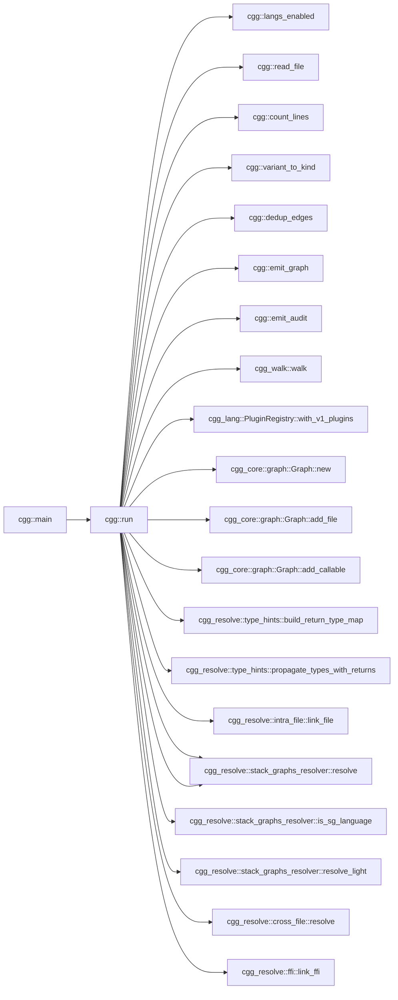
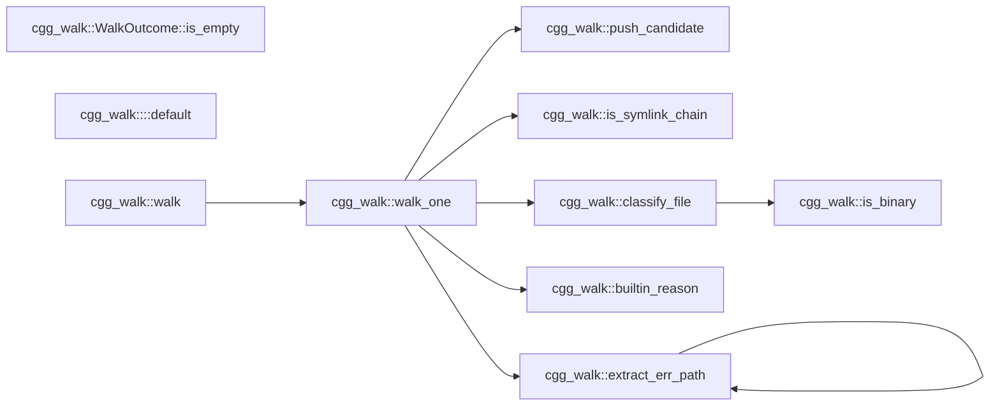
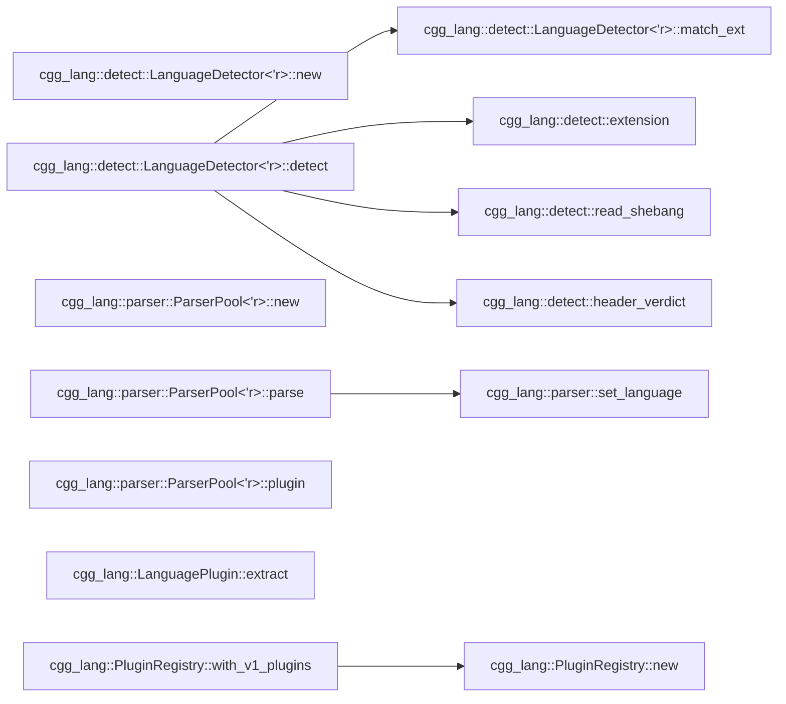

# cgg — Call Graph Generator

`cgg` is a single-binary, offline, multi-language call graph generator
written in Rust. It parses source code with tree-sitter and resolves
callable-to-callable edges to near-LSP quality without running any
language server.

**21 supported languages** — all at ≥90% callable detection vs ctags.

## Quick start

```
cargo install --path crates/cgg
cgg ./some/folder -o graph.mmd -t mermaid
```

Filter to N-hop neighborhoods or full entry-to-exit call paths:

```
cgg ./src --filter 'process_order' -n 2
cgg ./src --filter 'glob:handle_*' -n 0 -t json -o paths.json
```

## CLI options

```
cgg <paths>... [-o FILE] [-t mermaid|json|dot|graphml]
              [--filter PATTERN]... [-n N] [--max-paths N]
              [--stack-graphs auto|on|off]
              [--jobs N] [--lang rust,python,...]
              [--audit-format json|jsonl] [--metrics FILE]
              [-v|-vv|-q]
```

| Flag | Default | Description |
|------|---------|-------------|
| `-t` | mermaid | Output format: `mermaid`, `json`, `dot`, `graphml` |
| `-o` | stdout | Output file (use `-` for stdout) |
| `--filter` | (none) | Regex on qualified names; prefix `glob:` for glob |
| `-n` | -1 (full) | Hop depth around filter matches; `0` = full paths |
| `--stack-graphs` | auto | `auto`: 60s timeout + light fallback; `on`/`off` |
| `--jobs` | 0 (auto) | Rayon thread count for parallel extraction |
| `--lang` | (all) | Comma-separated language filter |
| `--metrics` | sidecar | Force audit output to a specific file |
| `--audit-format` | json | `json` (batched) or `jsonl` (streaming) |

## Supported Languages (21)

All languages are **✅ Fully Supported** (≥90% callable detection vs ctags):

| Language | Ratio vs ctags | Cross-file | Type Inference | Special Features |
|----------|---------------|------------|----------------|------------------|
| Rust | 235% | pub-use chains, Cargo.toml crate names | params + `Foo::new()` | Module paths from src/ |
| Python | 153% | from-import, import-as | params + `Foo()` | `__init__.py` package walk |
| JavaScript | 116% | ESM import + CJS require() | params | exports.fn, defineGetter |
| TypeScript | 336% | ESM import | params | Delegates to JS walker |
| Go | 179% | package imports | params + `var T` + `New*()` | Interface methods, func literals |
| Java | 212% | import + import static | params + `Type var` + `new Foo()` | Local variable types |
| Kotlin | 266% | import + as alias | params + `val x: T` + `Foo()` | Class-as-constructor |
| C | 168% | `#include` transitive (depth 8) | — | Macros as callables |
| C++ | 340% | `#include` transitive | — | Templates, operators |
| C# | 376% | using + using static + alias | params + `Type var` + `var x = new Foo()` | Accessors |
| Bash | 111% | `source ./file.sh` | — | Builtin filter |
| Ruby | 132% | require/require_relative | — | initialize → Constructor |
| PHP | 198% | require_once/include | — | — |
| Objective-C | 360% | #import | — | Message expressions |
| R | 102% | library() + source() | — | `<-` and `=` assignment |
| Swift | — | import Module | — | init → Constructor |
| Lua | 99% | require('mod') | — | Colon method syntax |
| Dart | — | import 'file.dart' | — | — |
| Scala | — | import pkg.Class | — | Object declarations |
| HCL | — | — | — | Block labels as definitions |
| Zig | — | @import("std") | — | — |

*Ratio >100% means cgg finds more callables than ctags (closures, trait impls, constructors, etc.)*
*— means ctags doesn't support this language for comparison*

## Benchmark

Run `./scripts/benchmark.sh` to reproduce. Results on real-world projects:

| Project | Language | Callables | Edges | Cross-file | Time |
|---------|----------|-----------|-------|------------|------|
| ripgrep | Rust | 2,733 | — | 8% | 255ms |
| flask | Python | 388 | — | — | 38ms |
| express | JavaScript | 92 | — | 13% | 15ms |
| zod | TypeScript | 1,675 | — | 64% | 415ms |
| fzf | Go | 1,048 | — | 12% | 159ms |
| gson | Java | 943 | — | 29% | 32ms |
| okio | Kotlin | 3,673 | — | 39% | 188ms |
| jq | C | 1,073 | — | 93% | 124ms |
| nlohmann/json | C++ | 1,122 | — | 15% | 110ms |
| serilog | C# | 828 | — | 67% | 55ms |
| acme.sh | Bash | 1,433 | — | — | 120ms |
| jekyll | Ruby | 902 | — | 31% | 38ms |
| laravel | PHP | 13,464 | — | — | 256ms |
| AFNetworking | Obj-C | 299 | — | 5% | 66ms |
| ggplot2 | R | 946 | — | — | 84ms |
| Alamofire | Swift | 829 | — | 6% | 69ms |
| kong | Lua | 2,782 | — | — | 119ms |
| flame | Dart | 1,647 | — | — | 70ms |
| play | Scala | 1,989 | — | — | 172ms |
| terraform-vpc | HCL | 1,779 | — | — | 97ms |
| http.zig | Zig | 451 | — | 37% | 81ms |

## Self-analysis

`cgg` analyzed on its own source (682 callables, 874 edges, 60
cross-file, 78ms). This graph shows `cgg::run` and its 1-hop
neighborhood — every edge is a real cross-crate function call
discovered by running:

```bash
cgg ./crates -t mermaid --filter 'cgg::run$' -n 1
```



The raw mermaid output (unfiltered) contains 682 nodes and 874 edges.
Use `--filter` to focus on specific subsystems:

```bash
# Show just the walker internals
cgg ./crates/cgg-walk -t mermaid

# Show the resolution pipeline
cgg ./crates --filter 'cgg_resolve::' -n 1 -t mermaid
```

<!-- cgg:begin:walk -->

<!-- cgg:end:walk -->

<!-- cgg:begin:lang -->

<!-- cgg:end:lang -->

## Architecture

```
cgg (binary)
├── Phase 1: cgg-walk        — file discovery (.gitignore, deny-list, binary sniff)
├── Phase 2: cgg-lang        — detect language, parse (tree-sitter), extract callables
│   └── 21 plugins           — rust, python, js, ts, go, java, kotlin, c, cpp, csharp,
│                               bash, ruby, swift, lua, php, dart, scala, hcl, zig, objc, r
├── Phase 3: cgg-resolve     — resolution pipeline
│   ├── type propagation     — param types, local vars, constructor inference, return types
│   ├── intra-file linker    — scope-based, smallest-enclosing-range
│   ├── cross-file resolver  — import-chain walking, #include transitive, pub-use chains
│   └── FFI linker           — PyO3, wasm-bindgen, napi, JNI, P/Invoke, C ABI
├── Phase 4: query engine    — --filter + -n (BFS neighborhood / full paths)
└── Phase 5: cgg-format      — mermaid, json, dot, graphml
```

## Type Propagation

Four strategies for resolving `obj.method()` calls without a type checker:

1. **Parameter types** — `fn foo(x: Service)` → x is Service
2. **Local variable declarations** — `Service svc = new Service()` → svc is Service
3. **Constructor inference** — `let x = Foo::new()` / `val x = Foo()` / `var x = new Foo()`
4. **Return-type propagation** — `let x = getConfig()` where getConfig → Config

## Output formats

- **mermaid**: `flowchart LR` with qualified-name labels
- **json**: Full graph via serde (callables, edges, files, metrics)
- **dot**: Graphviz `digraph` with `rankdir=LR`
- **graphml**: XML with node label and language data keys

## Audit / metrics

Every file considered, every callable extracted, and every unresolved
call is tracked. An audit sidecar (`<output>.audit.json`) is written
alongside the graph. Use `--metrics FILE` to force a path, or
`--audit-format jsonl` for streaming events.

## Scope

- Nodes: callables only (functions, methods, constructors, destructors,
  named lambdas, callable properties).
- Edges: "A calls B" within or across languages (FFI boundaries).
- Cycles preserved. Edge dedup: same (src, dst, site_byte) keeps highest confidence.
- Entry/exit detection: pure topology (in-degree 0 / out-degree 0).

## Not yet supported

- Additional languages: Elixir, Haskell, OCaml, Perl, Groovy.
- Macro expansion for C/C++.
- Full type inference (trait dispatch, generics, dynamic typing).
- Daemon / watch mode.

## License

Apache-2.0 OR MIT (dual). All transitive dependencies use MIT,
Apache-2.0, BSD, ISC, Unlicense, CC0, or BlueOak — enforced by
`cargo-deny`.
