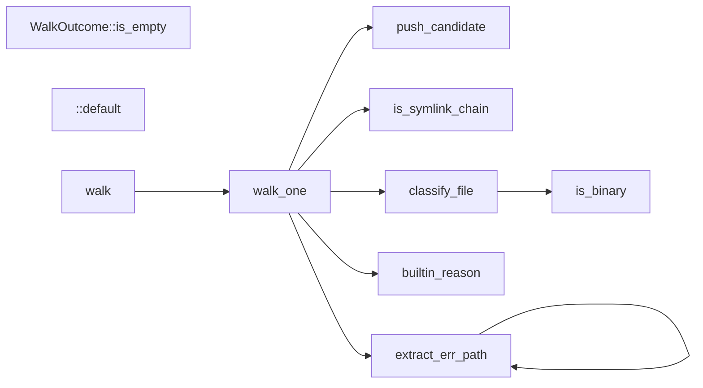
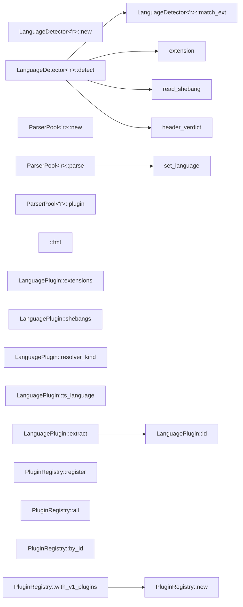

# cgg — Call Graph Generator

`cgg` is a single-binary, offline, multi-language call graph generator
written in Rust. It parses source code with tree-sitter and resolves
callable-to-callable edges to near-LSP quality without running any
language server.

Supported v1 languages: **Rust, Python, JavaScript, TypeScript, Go,
Java, C, C++, C#**.

## Quick start

```
cgg ./some/folder ./other/folder -o me-app.mmd -t mermaid
```

Optional filtering to N-hop neighborhoods or full entry-to-exit call
paths:

```
cgg ./src --filter 'process_order' -n 2
cgg ./src --filter 'glob:handle_*' -n 0 -t json -o paths.json
```

## Self-analysis

`cgg` is dogfooded on its own code. Both diagrams below were produced
by running `cgg` against this repository; neither is hand-drawn. Test
modules are filtered out and duplicate intra-file edges are deduped
for readability.

**`cgg-walk` — directory walker with built-in deny list and
gitignore/cggignore support:**

Generated with:
```
cgg ./crates/cgg-walk -t mermaid -o walk.mmd
```



Reading it: `walk` fans out to `walk_one`, which in turn consults the
built-in deny-list (`builtin_reason`), walks error paths
(`extract_err_path`, recursively), checks symlink targets
(`is_symlink_chain`), and classifies each surviving file
(`classify_file` → `is_binary`) before producing a `FileCandidate`
(`push_candidate`).

**`cgg-lang` — language detector and plugin registry:**

Generated with:
```
cgg ./crates/cgg-lang/src/detect.rs ./crates/cgg-lang/src/parser.rs \
    ./crates/cgg-lang/src/lib.rs -t mermaid
```



Reading it: `LanguageDetector::detect` consults `extension`,
`read_shebang`, and `header_verdict` (the `.h` disambiguator) before
delegating to `match_ext`. `ParserPool::parse` calls the private
`set_language` helper. `PluginRegistry::with_v1_plugins` wires every
plugin in via `register`.

Both graphs are reproducible on any checkout and will grow as the
codebase grows; Task 10's query engine will let us filter these to
N-hop neighborhoods around named callables.

## Output formats

`-t mermaid | json | dot | graphml`. The internal graph is shared; each
formatter is a thin transform over the same IR.

## Audit / metrics

Every file considered, every file skipped, every callable extracted,
and every unresolved call is tracked in a structured audit log. For
`-t json`, the audit is embedded in the output. For any other format,
an audit sidecar (`<output>.audit.json`) is written. `--audit-format
jsonl` streams per-file audit events for SIEM ingestion.

## Scope

- Nodes: callables only (functions, methods, named lambdas, callable
  properties, default methods on objects).
- Edges: "A calls B" within a language or across a declared FFI boundary
  (both sides must be inside the scanned roots).
- Entry / exit detection: pure topology (in-degree 0 / out-degree 0).
  Emergent HTTP handlers and registered callbacks surface naturally.
- Cycles (recursion, mutual recursion) are preserved — never silently
  removed.

## Out of scope (v1)

- Additional top-20 languages (Ruby, PHP, Kotlin, Swift, Scala, Dart,
  Lua, Shell, HCL). Plugin trait makes these straightforward to add.
- Real-LSP implementation behind the `ResolverService` trait — seam
  exists; implementation deferred.
- Daemon / watch mode.
- Macro expansion for C / C++ (macro call sites are emitted as
  unresolved with an audit note).

## License

Apache-2.0 OR MIT (dual). All transitive dependencies use MIT,
Apache-2.0, BSD, ISC, Unlicense, CC0, or BlueOak — enforced by
`cargo-deny`.
